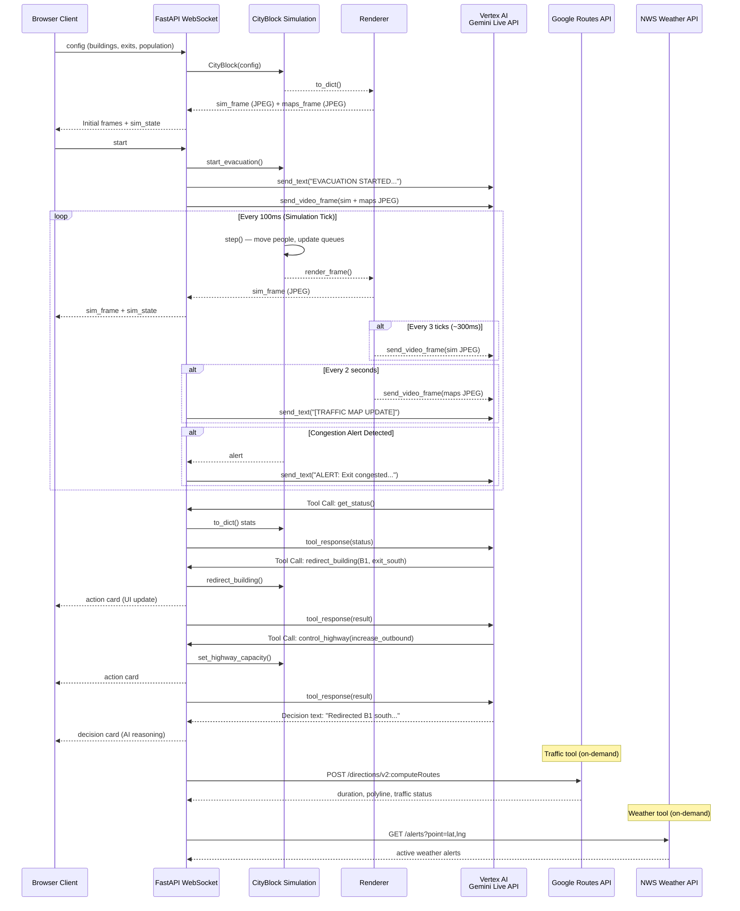
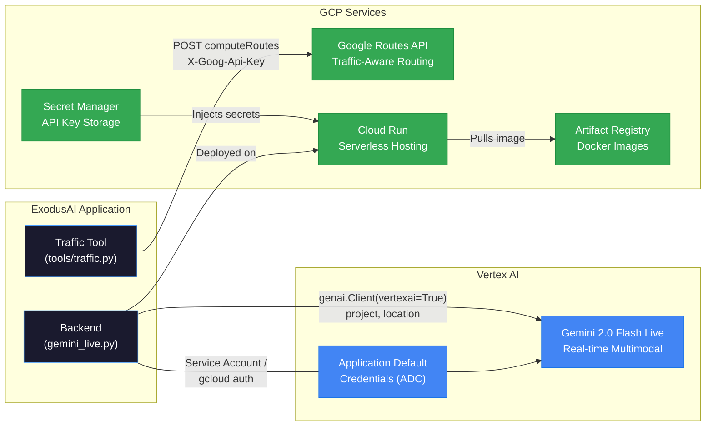

# ExodusAI — Architecture Diagram

## High-Level System Architecture

```mermaid
graph TB
    subgraph CLIENT["Client Layer"]
        FE["Web Frontend<br/>(HTML5 / Canvas / JS)"]
        ST["Streamlit Demo App<br/>(streamlit/app.py)"]
    end

    subgraph BACKEND["Backend — FastAPI Server (backend/main.py)"]
        WS["WebSocket Endpoint<br/>/ws"]
        API["REST API<br/>/health"]

        subgraph GEMINI_SESSION["Gemini Live Session (gemini_live.py)"]
            GL_CLIENT["GenAI Client<br/>(Vertex AI Backend)"]
            GL_CONNECT["Live API Connection<br/>send_text / send_video_frame"]
            GL_RECV["Streaming Response Handler<br/>receive_responses()"]
            GL_TOOLS["Tool Call Dispatcher<br/>_handle_tool_calls()"]
        end

        subgraph SIMULATION["Simulation Engine"]
            CB["CityBlock<br/>(city_block.py)"]
            PERSON["Person Agents"]
            BLDG["Buildings"]
            EXIT["Exits"]
            HWY["Highway"]
            REN["Renderer<br/>(renderer.py)"]
            MAPS_REN["Maps Renderer<br/>(maps_renderer.py)"]
            HAZARD["Hazard Overlays<br/>(hazard_overlays.py)"]
        end

        subgraph AGENTS["AI Agent Definitions"]
            EVAC["Evacuation Commander<br/>(evac_agent.py)"]
            VISION["Vision Analyst<br/>(vision_agent.py)"]
            ROUTE["Route Planner<br/>(route_agent.py)"]
            REPORT["Report Generator<br/>(report_agent.py)"]
            ROOT["Root Agent<br/>(agent.py)"]
        end

        subgraph TOOLS["External API Tools"]
            TRAFFIC["Traffic Tool<br/>(tools/traffic.py)"]
            WEATHER["Weather Tool<br/>(tools/weather.py)"]
            BUILDING["Building Tool<br/>(tools/building.py)"]
        end
    end

    subgraph GCP["Google Cloud Platform"]
        VERTEX["Vertex AI<br/>Gemini 2.0 Flash Live API"]
        ROUTES["Google Routes API<br/>(Traffic-Aware Routing)"]
        CR["Cloud Run<br/>(Serverless Compute)"]
        AR["Artifact Registry<br/>(Docker Images)"]
        SM["Secret Manager<br/>(API Keys)"]
    end

    subgraph EXTERNAL["External APIs"]
        NWS["National Weather Service API<br/>(Weather Alerts)"]
    end

    subgraph INFRA["Infrastructure as Code"]
        TF["Terraform<br/>(infra/main.tf)"]
        DOCKER["Dockerfile<br/>(backend/Dockerfile)"]
    end

    %% Client connections
    FE <-->|"WebSocket (JSON)"| WS
    ST -->|"Gemini API Key<br/>(Direct)"| VERTEX

    %% Backend internal flow
    WS --> GL_CLIENT
    GL_CLIENT -->|"vertexai=True<br/>project, location"| VERTEX
    GL_CONNECT --> GL_RECV
    GL_RECV --> GL_TOOLS
    GL_TOOLS --> EVAC
    GL_TOOLS --> CB

    %% Simulation flow
    CB --> PERSON
    CB --> BLDG
    CB --> EXIT
    CB --> HWY
    CB --> REN
    CB --> MAPS_REN
    REN -->|"JPEG Frames"| WS
    REN -->|"JPEG Frames"| GL_CONNECT
    MAPS_REN -->|"Traffic Map Frames"| WS
    MAPS_REN -->|"Traffic Map Frames"| GL_CONNECT

    %% Agent flow
    ROOT --> TRAFFIC
    ROOT --> WEATHER
    ROOT --> BUILDING
    ROOT --> REPORT
    EVAC -->|"Tool Declarations"| GL_CLIENT
    VISION -->|"Frame Analysis"| GL_CLIENT

    %% External API calls
    TRAFFIC -->|"HTTP POST<br/>X-Goog-Api-Key"| ROUTES
    WEATHER -->|"HTTP GET"| NWS

    %% Infrastructure
    TF --> CR
    TF --> AR
    TF --> SM
    DOCKER --> AR
    SM -->|"Inject Secrets"| CR

    %% Styling
    classDef gcp fill:#4285F4,stroke:#1a73e8,color:#fff
    classDef external fill:#34A853,stroke:#1e8e3e,color:#fff
    classDef client fill:#FBBC04,stroke:#f9a825,color:#000
    classDef backend fill:#1a1a2e,stroke:#4a9eff,color:#fff
    classDef infra fill:#7B1FA2,stroke:#6A1B9A,color:#fff

    class VERTEX,ROUTES,CR,AR,SM gcp
    class NWS external
    class FE,ST client
    class TF,DOCKER infra
```



## Data Flow — Real-Time Evacuation Loop



## Google Cloud Services Integration



## Project Structure

```
evacuai/
├── backend/
│   ├── main.py                  # FastAPI server, WebSocket, simulation loop
│   ├── gemini_live.py           # Vertex AI Gemini Live API session wrapper
│   ├── Dockerfile               # Container image (Python 3.12-slim)
│   ├── requirements.txt         # Python dependencies
│   ├── agents/
│   │   ├── agent.py             # Root agent — tool declarations & dispatcher
│   │   ├── evac_agent.py        # Evacuation commander prompts & sim tools
│   │   ├── vision_agent.py      # Video frame hazard analysis
│   │   ├── route_agent.py       # Evacuation route planning logic
│   │   └── report_agent.py      # Situation report generator
│   ├── tools/
│   │   ├── traffic.py           # Google Routes API integration
│   │   ├── weather.py           # NWS Weather API integration
│   │   └── building.py          # Building layout & hazard tracking
│   └── simulation/
│       ├── city_block.py        # Agent-based evacuation simulation engine
│       ├── renderer.py          # 2D city block frame renderer (OpenCV)
│       ├── maps_renderer.py     # Traffic map view renderer
│       ├── hazard_overlays.py   # Hazard visualization overlays
│       └── mock_traffic.py      # Mock traffic data for testing
├── frontend/
│   ├── index.html               # 3-panel web dashboard
│   ├── main.js                  # WebSocket client & UI logic
│   ├── gemini-client.js         # Gemini API client helpers
│   ├── media-handler.js         # Media stream handling
│   └── pcm-processor.js         # Audio PCM processor
├── streamlit/
│   ├── app.py                   # Standalone Streamlit demo (API key auth)
│   └── requirements.txt         # Streamlit dependencies
├── infra/
│   ├── main.tf                  # Terraform — Cloud Run, Artifact Registry, Secrets
│   ├── variables.tf             # Terraform variables
│   └── deploy.sh                # Deployment script
├── scenarios/                   # Scenario configurations
├── demo/                        # Demo videos & screenshots
├── .env.example                 # Environment variable template
└── README.md
```
